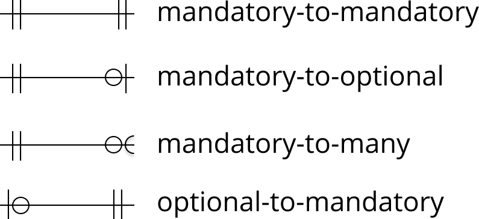

# Supporting Information for “Construction, Deployment, and Usage of the Human Reference Atlas Knowledge Graph for Linked Open Data”

Andreas Bueckle1*, Bruce W. Herr II1*, Josef Hardi2, Ellen M Quardokus1, Mark Musen2, Katy Börner1\*

1 Department of Intelligent Systems Engineering, Luddy School of Informatics, Computing, and Engineering, Indiana University, Bloomington, IN, USA\
2 Stanford Center for Biomedical Informatics Research, Stanford University, Stanford, California, USA

\* Corresponding authors

# Links

- Link to preprint: [https://doi.org/10.1101/2024.12.22.630006](https://doi.org/10.1101/2024.12.22.630006)
- Link to GitHub: [https://github.com/cns-iu/hra-kg-supporting-information](https://github.com/cns-iu/hra-kg-supporting-information)
- Link to LOD server: [https://lod.humanatlas.io](https://lod.humanatlas.io)
- Link to HRA Dashboard with HRA KG data as of HRA v2.2: [https://apps.humanatlas.io/dashboard/data](https://apps.humanatlas.io/dashboard/data)

# Basic Usage

Examples are shown below. Advanced usage examples are shown at [https://github.com/cns-iu/hra-kg-supporting-information/blob/main/README.md](https://github.com/cns-iu/hra-kg-supporting-information/blob/main/README.md).

## Notebook to access an ASCT+B table for the kidney

This notebook exemplarily retrieves the most recent versions of all ASCT+B tables in the latest hra collection in the JSON format, which is one of the most widely used data exchange formats, and that can be read by almost every modern programming language. It then selects the table for the kidney. It then inspects the kidney table by outputting the number of rows, and finally prints a small selection of AS, CT, gene Bs, and scientific references for a particular AS-CT-B record. 

The notebook is available here: [https://github.com/x-atlas-consortia/hra-notebooks/blob/main/notebooks/hra-asctb-tables.ipynb](https://github.com/x-atlas-consortia/hra-notebooks/blob/main/notebooks/hra-asctb-tables.ipynb)

## Notebook to query the HRA Knowledge Graph (KG) 

In a slightly more advanced example, we show how you can query the HRA KG in three ways: (1) getting processed HRA DOs in JSON, see also [above](#notebook-to-access-an-asctb-table-for-the-kidney), (2) running a SPARQL query via [grlc.io](https://grlc.io/), and (3) running a SPARQL query you wrote on your own. The notebook presents this across three sections, see below. To illustrate this, we get the latest ASCT+B table for the kidney, then print the first five records (Example 1). Next, we run a SPARQL query to get a CSV file of all AS-CT-B records for the lymph node (Example 2). Then, we run a SPARQL query to get all triples in the HRA KG and print the first five. Finally, the notebook shows how you can compile a table of unique CTs in the cortex of kidney first declaratively (via SPARQL), and then imperatively (via JSON and  Python):

- Example 1: Get an HRA Digital Object (DO) as a JSON file
- Example 2: Run a SPARQL query via ‘grlc’ with ‘requests’
- Example 3: Run a SPARQL query with ‘requests’
- Demonstration on how to use the HRA KG either declaratively (via SPARQL) or imperatively (via JSON)

Link: [https://github.com/cns-iu/hra-kg-supporting-information/blob/main/notebooks/hra-kg-queries.ipynb](https://github.com/cns-iu/hra-kg-supporting-information/blob/main/notebooks/hra-kg-queries.ipynb)

# How to Run Queries via our OpenAPI Spec

The query interface at [https://apps.humanatlas.io/api/grlc/hra.html](https://apps.humanatlas.io/api/grlc/hra.html) documents a growing number of canned, curated SPARQL queries. Each query has its own row, see **Figure 1**.

**Figure 1**. The row containing the query to get AS, CT, and B counts for all ASCT+B tables in the latest HRA release. 

When you click on a row, it expands to reveal the entire documentation for the query, see **Figure 2**.

**Figure 2**. The expanded query documentation for [https://apps.humanatlas.io/api/grlc/hra.html#get-/as-ct-b-counts](https://apps.humanatlas.io/api/grlc/hra.html#get-/as-ct-b-counts). 

The documentation presents four major parts: (1) the pre-made, canned SPARQL query to be run, (2) query string parameters that allow you to customize the query (in this case, you do not need to provide anything as there is a default that can be used), (3) buttons to pre-fill any required fields with examples (see second example below), clear all the fields, and running the query, and (4) the response once the query is run, see **Figure 3**, by pressing the Try button (**Figure 2 (3), right**). 

**Figure 3**. The query response for [https://apps.humanatlas.io/api/grlc/hra.html#get-/as-ct-b-counts](https://apps.humanatlas.io/api/grlc/hra.html#get-/as-ct-b-counts). 

Once the query is run, the response is printed in the response area (1). You can copy it to your clipboard with the copy button (2).  

Some queries require you to specify query parameters before running it. The query at [https://apps.humanatlas.io/api/grlc/hra.html#get-/asctb-in-table](https://apps.humanatlas.io/api/grlc/hra.html#get-/asctb-in-table), for instance, requires a PURL for an ASCT+B table to be filled into the *asctb* query parameter, see the entire workflow in **Figure 4**. 

**Figure 4**. Filling in defaults for [https://apps.humanatlas.io/api/grlc/hra.html#get-/asctb-in-table](https://apps.humanatlas.io/api/grlc/hra.html#get-/asctb-in-table), then running the query and inspecting the result. 

The query needs to know which table you would like. It thus presents a query parameter that requires an identifier for an ASCT+B table (1), see **Figure 4**. The default value for the *asctb* query parameter is the PURL for the lymph node. Clicking the Fill Example button (2) will fill this default value in for you (3). When you then run the query, you get your response in the response field (4). Of course, you can add any other PURL. For example, the one for the brain is [https://purl.humanatlas.io/asct-b/allen-brain](https://purl.humanatlas.io/asct-b/allen-brain). 

# Example Queries

Frequently used queries run via the SPARQL endpoint of the HRA API are listed in Table 1. All queries use data from the HRA v2.2 and the table reports counts for HRA DOs retrieved on December 17, 2024; note that the paper reports data available on December 17, 2024. To explore other queries, for additional documentation, and to get up-to-date results, visit [https://apps.humanatlas.io/api/grlc/hra.html](https://apps.humanatlas.io/api/grlc/hra.html) for HRA queries and [https://apps.humanatlas.io/api/grlc/hra-pop.html](https://apps.humanatlas.io/api/grlc/hra-pop.html) for HRApop queries.

**Table 1**. Common queries run during HRA usage. 

| Description                                         	| Count                                                                                                                                                                 	| Query 	|  
|-----------------------------------------------------	|-----------------------------------------------------------------------------------------------------------------------------------------------------------------------	|-------	|
| *HRA*                                                 	|                                                                                                                                                                       	|       	|  
| Count of 3D Anatomical Structures                   	| label,count 3D anatomical structures (no united and no reference organ AS),1224 3D anatomical structures (no united),1295 3D reference organs (no united),71 	| [Query](https://apps.humanatlas.io/api/grlc/hra.html#get-/as-3d-counts) 	| 
| Unique AS, CT, and B in HRA                         	| asctb_type,count AS,4694 BM,2018 CT,1288                                                                                                                     	| [Query](https://apps.humanatlas.io/api/grlc/hra.html#get-/as-ct-b-counts) 	|   
| Unique AS, CT, and B across all HRA versions        	| asctb_type,count AS,5800 BM,2531 CT,2268                                                                                                                     	| [Query](https://apps.humanatlas.io/api/grlc/hra.html#get-/as-ct-b-counts-all-versions) 	| 
| Digital objects counts in the latest HRA release    	| type,count 2d-ftu,23 asct-b,38 ctann,3 omap,23 ref-organ,71 vascular-geometry,1                                                                     	| [Query](https://apps.humanatlas.io/api/grlc/hra.html#get-/digital-object-count) 	| 
| High-level stats about the latest HRA release       	| label,count # Nodes,242463 # Edges,1920570 # Edge Types,248                                                                                                  	| [Query](https://apps.humanatlas.io/api/grlc/hra.html#get-/high-level-stats) 	| 
| *HRApop*                                              	|                                                                                                                                                                       	|       	|
| Number of Anatomical Structures with Cell Summaries 	| 60                                                                                                                                                                    	| [Query](https://apps.humanatlas.io/api/grlc/hra-pop.html#get-/as-count) 	|

# Comparison to other KGs

## Statistics for RDF-based KGs

To get statistics for RDF-based KGs, please run: [https://github.com/cns-iu/hra-kg-supporting-information/blob/main/notebooks/rdf-kg-stats.ipynb](https://github.com/cns-iu/hra-kg-supporting-information/blob/main/notebooks/rdf-kg-stats.ipynb)

## Comparison queries
 A full list of SPARQL and Cypher queries can be found at [https://github.com/cns-iu/hra-kg-supporting-information/blob/main/comparison-queries.md](https://github.com/cns-iu/hra-kg-supporting-information/blob/main/comparison-queries.md).

## Size
RDF-based KGs were converted to N-Quads to get the total uncompressed size for each. To compare sizes, Neo4J KGs were converted to RDF N-Quad format; the context is at [https://github.com/cns-iu/hra-kg-supporting-information/blob/main/src/neo4j-json-export-context.jsonld](https://github.com/cns-iu/hra-kg-supporting-information/blob/main/src/neo4j-json-export-context.jsonld). Documentation is at: [https://github.com/cns-iu/hra-kg-supporting-information/blob/main/comparison-queries.md](https://github.com/cns-iu/hra-kg-supporting-information/blob/main/comparison-queries.md).

# Resources
Additional links to documentation of KG-relevant terminology and concepts:

- A good overview of RDF Graph Data Model is provided by Stardog: [https://docs.stardog.com/tutorials/rdf-graph-data-model](https://docs.stardog.com/tutorials/rdf-graph-data-model)
- Wouter Beek (co-founder of [Triply](https://triply.cc/en-US), see also [https://wouterbeek.github.io/](https://wouterbeek.github.io/)) recorded this detailed series of tutorials about SPARQL on [YouTube](https://www.youtube.com/playlist?list=PLaa8QYrMzXNnzY-4YVM5507iZuESWVcnU).
- A video about ontologies by co-author Mark Musen is [here](https://youtu.be/PrLY3Gzj6w4?si=ToMyiT1ZJLufbxT7).
- A talk titled "FAIR Data Knowledge Graphs – From Theory to Practice" by Tom Plasterer, Ph.D., Senior Director of Bioinformatics and BioPharmaceutical R\&D at [AstraZeneca](https://www.astrazeneca.com/) is available on [YouTube](https://www.youtube.com/watch?v=Z0U2O2FjL6w).

# Using LLMs and RAG with HRA KG
This notebook shows how to setup a basic vector database populated from the HRA KG which is then used to augment prompts to an LLM: [https://github.com/x-atlas-consortia/hra-notebooks/blob/main/notebooks/hra-rag.ipynb](https://github.com/x-atlas-consortia/hra-notebooks/blob/main/notebooks/hra-rag.ipynb)

# Mermaid Diagrams

Entity relationship (ER) diagrams explain the relationships between entities within HRA DOs. ER diagrams for the hra-do-processor can be explored visually using the Mermaid (MMD) format ([https://mermaid.js.org/](https://mermaid.js.org)). The following link types are used to describe cardinality and optionality between connected nodes:
1. `||--||`: Represents a mandatory-to-mandatory relationship, i.e., both entities are required for the relationship
   
2. `||--|o`: Represents a mandatory-to-optional relationship, where one side is required while the other side may or may not
   
3. `||--}o`: Represents a mandatory-to-many relationship, with one side required and the other allowing multiple occurrences.
   
4. `o|--||`: Represents an optional-to-mandatory relationship, where one side may or may not be required, but the other is

**Figure 5** below illustrates how these ER link types are rendered in the ER diagrams in **Figures 6-9**.

**Figure 5**. A legend explaining different visuals for explaining ER link types in the HRA DO types of the HRA. 

Exemplarily shown below are MMD diagrams for the *2d-ftu* (**Figure 6**), *asct-b* (**Figure 7**), *ref-organ* (**Figure 8**), and *ds-graph* (**Figure 9**) HRA DO types. All MMD diagrams are available at [https://github.com/hubmapconsortium/hra-do-processor/blob/main/er-diagrams.md/](https://github.com/hubmapconsortium/hra-do-processor/blob/main/er-diagrams.md/). Note that in the figures in the paper, we omitted underscores in edge labels and added spaces for legibility. 

**Figure 6**. An ER diagram for the *2d-ftu* HRA DO type. Click [here](https://raw.githubusercontent.com/hubmapconsortium/hra-do-processor/e138a5e639a3e2a39e5117e53f8fef049274b457/docs/er-diagrams/index-1.svg) to download the SVG version. 

---

**Figure 7**. ER diagram for the *asct-b* HRA DO type. Click [here](https://raw.githubusercontent.com/hubmapconsortium/hra-do-processor/e138a5e639a3e2a39e5117e53f8fef049274b457/docs/er-diagrams/index-2.svg) to download the  SVG version.

---

**Figure 8**. ER diagram for the *ref-organ* HRA DO type. Click [here](https://raw.githubusercontent.com/hubmapconsortium/hra-do-processor/e138a5e639a3e2a39e5117e53f8fef049274b457/docs/er-diagrams/index-9.svg) to download the SVG version.

---

**Figure 9**. ER diagram for the *ds-graph* HRA DO type. Click [here](https://raw.githubusercontent.com/hubmapconsortium/hra-do-processor/refs/heads/main/docs/er-diagrams/index-10.svg) to download the SVG version.
